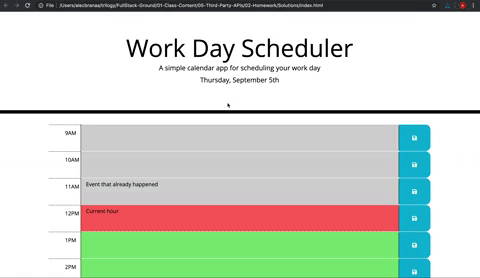

# Work_Day_Scheduler
Work Day Scheduler is a calendar application that allows a user to save events for each hour of the day.

Application deployed at live URL : <a href= "https://monicadolce.github.io/Work_Day_Scheduler/">Visit Live Javascript Quiz</a>

Application GitHub URL : <a href= "https://github.com/monicadolce/Work_Day_Scheduler">Visit Monica's GitHub Repository</a> 
